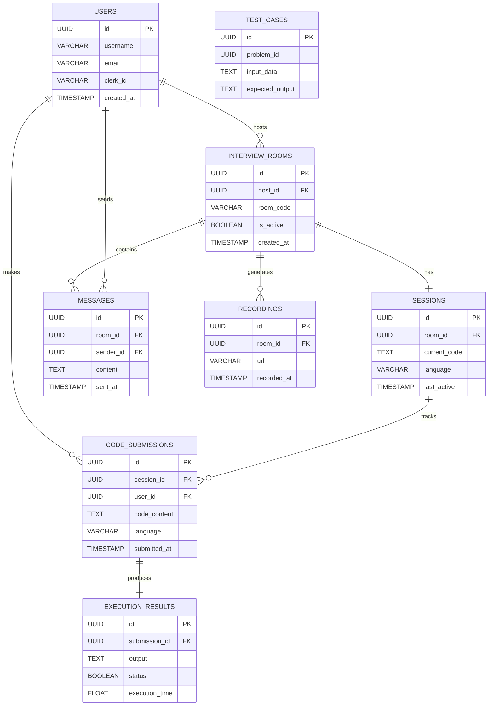

# Entity Relationship Diagram

This diagram details the database schema, illustrating the tables, their primary keys, and relationships.

```mermaid
erDiagram
    USERS {
        UUID id PK
        VARCHAR username
        VARCHAR email
        VARCHAR clerk_id
        TIMESTAMP created_at
    }

    INTERVIEW_ROOMS {
        UUID id PK
        UUID host_id FK
        VARCHAR room_code
        BOOLEAN is_active
        TIMESTAMP created_at
    }

    SESSIONS {
        UUID id PK
        UUID room_id FK
        TEXT current_code
        VARCHAR language
        TIMESTAMP last_active
    }

    CODE_SUBMISSIONS {
        UUID id PK
        UUID session_id FK
        UUID user_id FK
        TEXT code_content
        VARCHAR language
        TIMESTAMP submitted_at
    }

    EXECUTION_RESULTS {
        UUID id PK
        UUID submission_id FK
        TEXT output
        BOOLEAN status
        FLOAT execution_time
    }

    TEST_CASES {
        UUID id PK
        UUID problem_id
        TEXT input_data
        TEXT expected_output
    }

    MESSAGES {
        UUID id PK
        UUID room_id FK
        UUID sender_id FK
        TEXT content
        TIMESTAMP sent_at
    }

    RECORDINGS {
        UUID id PK
        UUID room_id FK
        VARCHAR url
        TIMESTAMP recorded_at
    }

    %% Relationships
    USERS ||--o{ INTERVIEW_ROOMS : hosts
    INTERVIEW_ROOMS ||--|| SESSIONS : has
    INTERVIEW_ROOMS ||--o{ MESSAGES : contains
    INTERVIEW_ROOMS ||--o{ RECORDINGS : generates
    USERS ||--o{ MESSAGES : sends
    USERS ||--o{ CODE_SUBMISSIONS : makes
    SESSIONS ||--o{ CODE_SUBMISSIONS : tracks
    CODE_SUBMISSIONS ||--|| EXECUTION_RESULTS : produces
```
