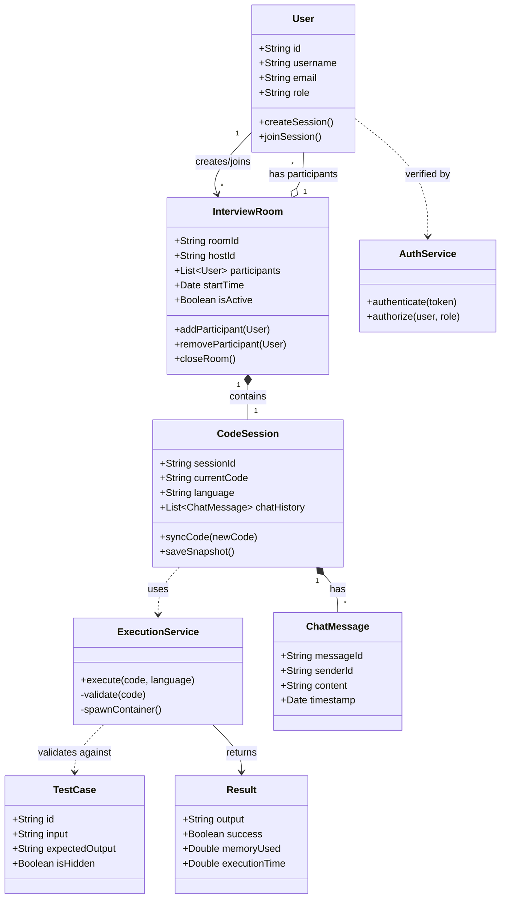

# Class Diagram

This diagram represents the backend Object-Oriented Architecture, showing the relationships between core entities and services.

```mermaid
classDiagram
    class User {
        +String id
        +String username
        +String email
        +String role
        +createSession()
        +joinSession()
    }

    class InterviewRoom {
        +String roomId
        +String hostId
        +List~User~ participants
        +Date startTime
        +Boolean isActive
        +addParticipant(User)
        +removeParticipant(User)
        +closeRoom()
    }

    class CodeSession {
        +String sessionId
        +String currentCode
        +String language
        +List~ChatMessage~ chatHistory
        +syncCode(newCode)
        +saveSnapshot()
    }

    class ExecutionService {
        +execute(code, language)
        -validate(code)
        -spawnContainer()
    }

    class TestCase {
        +String id
        +String input
        +String expectedOutput
        +Boolean isHidden
    }

    class Result {
        +String output
        +Boolean success
        +Double memoryUsed
        +Double executionTime
    }

    class ChatMessage {
        +String messageId
        +String senderId
        +String content
        +Date timestamp
    }

    class AuthService {
        +authenticate(token)
        +authorize(user, role)
    }

    %% Relationships
    User "1" --> "*" InterviewRoom : creates/joins
    InterviewRoom "1" *-- "1" CodeSession : contains
    InterviewRoom "1" o-- "*" User : has participants
    CodeSession "1" *-- "*" ChatMessage : has
    CodeSession ..> ExecutionService : uses
    ExecutionService ..> TestCase : validates against
    ExecutionService --> Result : returns
    User ..> AuthService : verified by
```
