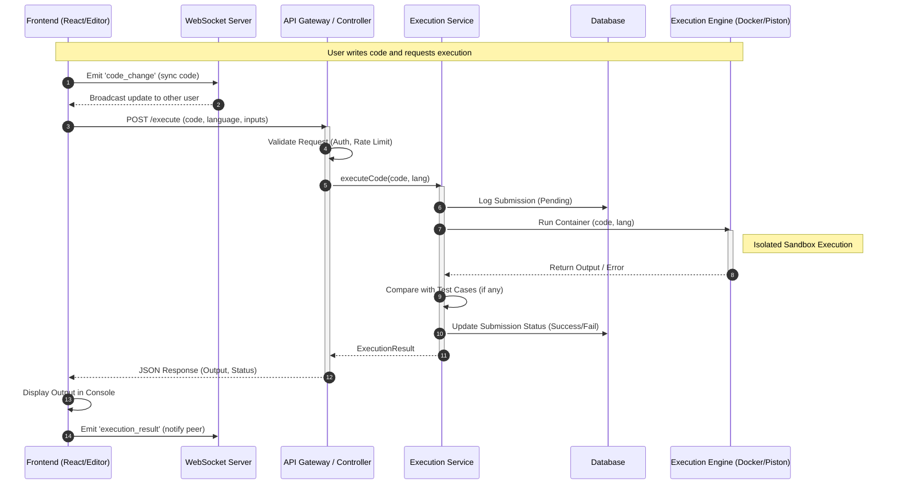

# Sequence Diagram

This diagram illustrates the flow of code execution within an interview session, from the frontend to the backend execution engine and back.

```mermaid
sequenceDiagram
    autonumber
    participant FE as Frontend (React/Editor)
    participant WS as WebSocket Server
    participant API as API Gateway / Controller
    participant SVC as Execution Service
    participant DB as Database
    participant ENG as Execution Engine (Docker/Piston)

    Note over FE, ENG: User writes code and requests execution

    FE->>WS: Emit 'code_change' (sync code)
    WS-->>FE: Broadcast update to other user

    FE->>API: POST /execute (code, language, inputs)
    activate API
    
    API->>API: Validate Request (Auth, Rate Limit)
    
    API->>SVC: executeCode(code, lang)
    activate SVC
    
    SVC->>DB: Log Submission (Pending)
    
    SVC->>ENG: Run Container (code, lang)
    activate ENG
    Note right of ENG: Isolated Sandbox Execution
    ENG-->>SVC: Return Output / Error
    deactivate ENG
    
    SVC->>SVC: Compare with Test Cases (if any)
    
    SVC->>DB: Update Submission Status (Success/Fail)
    
    SVC-->>API: ExecutionResult
    deactivate SVC
    
    API-->>FE: JSON Response (Output, Status)
    deactivate API

    FE->>FE: Display Output in Console
    FE->>WS: Emit 'execution_result' (notify peer)
```
